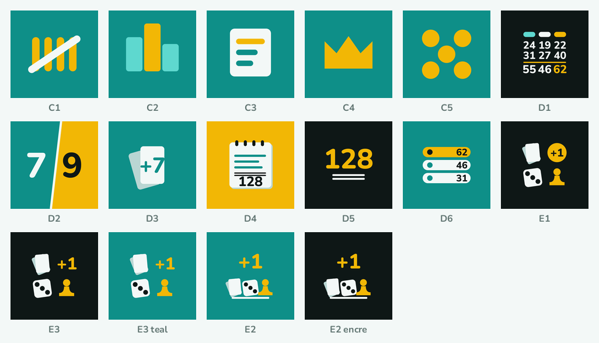
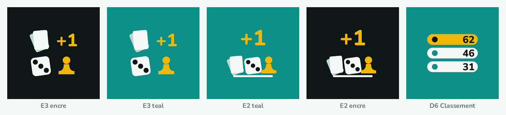
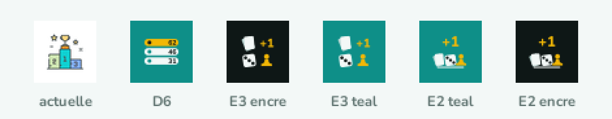
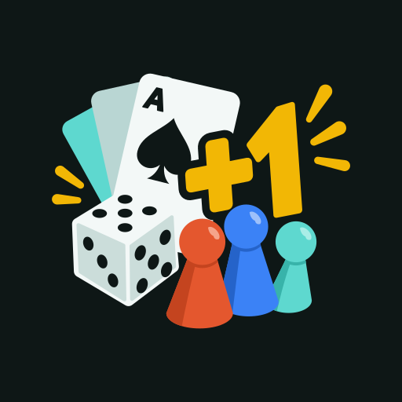
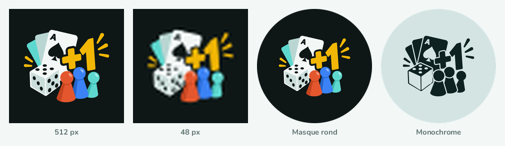

# The app icon does not say what the app does

**Status:** done (2026-09-20) — closed by feat/app-icon. The chosen artwork is wired through
the whole pipeline. Its permanent home is **`design/icon/`** (the six working SVGs plus
`source-from-chatgpt.svg`, the untouched original) and **`scripts/generate_icons.py`** (what
`tools/gen5.py` became: it reproduces the four decided SVGs byte for byte, adds a maskable
and a favicon source, and rasterizes every destination). `svg/` and `tools/` are gone from
`../assets/` so there is only one generator; the entry's images stay. `pubspec.yaml` now
passes `adaptive_icon_background: "#0E1716"`, the measured `adaptive_foreground.png`, an
`adaptive_icon_monochrome` and `adaptive_icon_foreground_inset: 8`; `colors.xml` reads
`#0E1716`. Checked by rendering: the flat icon at 32/48/64/96, the adaptive layers under a
circle and a squircle mask, the themed layer tinted on a light ground, the maskable pair
under a full circle — nothing clipped, the monochrome legible rather than a blob. The
procedure and the reasoning are `.llmwiki/Release.md` §Icons. Not in this pull request, by
design: the feature graphic redraw, the two stale guides in `store_listing/`, and the
`lib/utils/app_theme.dart:5` comment about the icon's podium.

- **Noted:** 2026-09-20 — while reviewing the icon against ASO guidance the user supplied
- **Theme:** visual-refresh
- **Area:** android
- **Blocks release:** no

`store_listing/assets/icon_512.png` is stock clipart — a podium, a trophy, two stars, a
sparkle and the digits 1-2-3, in six colours with ~2 px outlines, on a transparent/white
field. At 48 px none of it survives, and against the Play Store's white results page the
icon has no edge at all. It also has no recorded provenance: one commit, `75dc8f6 "Update
app icon"`, no attribution anywhere in the repository.

**The category's own evidence.** Twelve icons read off the Play Store searches *compteur de
points cartes société* and *score keeper board games* on 2026-09-20:

| App | Rating | What its icon shows | Digits |
|---|---|---|---|
| Score points (Anthony49Dev) | 5,0 | a trophy on colour blobs | no |
| Points Scorer (Etologic) | 4,9 | "100" on a black shield | yes |
| Compteur : comptez tout (napps) | 4,8 | "+10" white on a teal tile | yes |
| Compteur de points (Romain Lebouc) | 4,8 | a white abacus on teal | no |
| Compteur de Score (Torsten Hoffmann) | 4,7 | a score table, 105 / 254 | yes |
| Score Counter – For any game (Szabolcs Árvai) | 4,7 | white cards with "+1" | yes |
| Multi Compteur (Umit YILMAZ) | 4,6 | "1 2 3" on black | yes |
| Scoreboard – Keep score (Truyendiv) | 4,6 | "5 \| 4", red against blue | yes |
| Score It (SBG Apps) | 4,6 | two orange tiles on cream | no |
| Score Counter (Martin Váňa) | 4,4 | a grid, 24 19 22 / 51 53 49 | yes |
| Scoreboard – Track Score (CensaSoft) | 4,4 | "2 \| 0", blue against red | yes |
| **CountScore (vemore)** | — | **a pale podium on white** | **no** |

Three findings follow. **Digits are the category's language** — eight of the twelve carry
them, and a digit needs no translation, which matters across ten locales. **The ground is
saturated and full-bleed** in almost all of them; CountScore is the only white one, which is
why it dissolves between its neighbours instead of standing out. **Teal is not
differentiating here**: two of the five best-rated apps on the shelf are teal, including the
direct competitor "+10".

**Sixteen candidates were drawn** and are in `../assets/2026-09-20-the-app-icon-does-not-say-what-the-app-does/`:

C1–C5 carried no digits and each named an idea next to the product rather than the product.
D1–D6 carried digits, but **D1** (a number grid) and **D3** (cards with a "+1") are already
the icons of Score Counter and Score Counter – For any game, and **D2** is the shelf's most
copied shape. D6 and the E-series ensemble were the shortlist, until the owner drew a
better ensemble than any of them.

**The artwork is decided** (2026-09-20). None of the sixteen won: the owner generated an
ensemble with ChatGPT and had it transcribed to SVG, and it reads better than anything
drawn here — a fan of cards with an ace, a "+1", an isometric die and **three pawns**,
which say "several players" with no digit at all. That last part is what every candidate
above missed.

It did not survive the pipeline as drawn, so `svg/chosen*.svg` is that artwork hardened —
the shapes and their positions are untouched, and `svg/source-from-chatgpt.svg` is what it
started from (its C2PA manifest stripped, it drew nothing). Three changes:

- **Reframed.** 31.2% of its subject fell outside the 66% adaptive safe circle; measured
  and refitted, the flat icon reaches r=440 of the 512 canvas and the adaptive foreground
  r=367.8 of 368 — nothing clipped.
- **Flattened.** The two linear gradients became flat fills and the fake drop shadow under
  the "+1" (a dark copy of the glyph at `translate(8,10)`) is gone. The pawns' two-tone
  shading stays: those are solid fills, and they hold at every size.
- **A monochrome layer, authored.** It cannot be derived — flattening the file to one
  colour gives a blob. Cards in ink each freed from the one beneath, the ace and the spade
  as holes, the die solid with its edges as hairlines and its pips as holes, the three
  pawns separated, the "+1" at the weight of the glyph rather than of its keyline.

**Repainted in the app's palette** (the owner's call, 2026-09-20), because the original
navy is the most crowded ground on this shelf: ink `#0E1716`, the leader's gold `#F2B705`
on the "+1" and the rays, cream cards and die, and the three pawns in real player colours
from `lib/utils/player_colors.dart` — vermilion `#E4572E`, blue `#3B82F6`, and the brand's
light teal `#5ED8CF`. The icon, `app_theme.dart` and the store listing become one identity
again. Keeping the navy was the alternative and would have meant repainting the app,
the feature graphic and ten locales of screenshots instead.

**Fix:** wire `svg/chosen*.svg` through everything the icon touches. `chosen.svg` is the
flat icon, `chosen-adaptive-fg.svg` and `chosen-adaptive-bg.svg` the two Android layers,
`chosen-mono.svg` the themed one. Adopting it closes most of
[[2026-09-20-the-app-icon-has-no-vector-source-and-no-monochrome-layer]] at the same time.
`tools/gen5.py` regenerates all four from the source artwork and holds both palettes;
`gen2.py`/`gen3.py` built the sixteen candidates. They encode the two things that are easy
to get wrong: the safe-zone fit is *measured* from the rendered alpha, because analytic
bounds on rotated shapes overstate the ink by a third; and a monochrome shape carrying no
`fill` attribute falls back to black, which is invisible against the mask — that is what
made the pawns and the rays disappear from the first monochrome layer.

The change spans: `store_listing/assets/icon_512.png`, `dart run flutter_launcher_icons`, a
brand `adaptive_icon_background` instead of `#FFFFFF`, an `adaptive_icon_monochrome`, the
five web files of [[2026-09-20-pwa-icons-are-still-the-flutter-logo]], the two in-app uses
(`lib/screens/home_screen.dart:178`, `lib/screens/about_screen.dart:38`), the Pillow feature
graphic that insets the icon, the comment at `lib/utils/app_theme.dart:5` that says the teal
comes "from the icon's podium", and the stale guides of
[[2026-09-20-the-brand-docs-still-describe-the-abandoned-purple]].

**Acceptance:**
- `svg/chosen*.svg` ships as the source, and a documented command regenerates every raster.
- At 48 px the icon reads as score-keeping, not as a smudge — checked on a real render.
- Nothing is clipped under a circular mask, and the themed monochrome icon is legible.
- The launcher tile, the PWA icons and the in-app asset all show the same new artwork.
- `.llmwiki/Release.md`'s icon section matches the new procedure and its `Updated:` moves.
- The adaptive background is the artwork's ink `#0E1716` and `colors.xml`'s
  `ic_launcher_background` matches it — no white tile is left anywhere.
- `pubspec.yaml` passes an `adaptive_icon_monochrome`, and `grep -rn monochrome android/
  pubspec.yaml` stops returning nothing.

## Absorbed (2026-09-20, refinement)

This entry is now the only one on the app icon. It carries
**`2026-09-20-the-app-icon-has-no-vector-source-and-no-monochrome-layer`**, dropped into
`done/` the same day, and with it the three faults that entry found in how the icon is
*authored and wired*, independently of what it depicts:

- **No vector source.** `store_listing/assets/icon_512.png` was the only original — one
  commit, `75dc8f6 "Update app icon"`, no provenance or attribution anywhere.
  `svg/chosen*.svg` is the answer, and `tools/gen5.py` the command.
- **The adaptive foreground is the full-bleed icon.** `pubspec.yaml:137-139` passes the same
  512 PNG as `adaptive_icon_foreground`, which `mipmap-anydpi-v26/ic_launcher.xml` insets by
  16 %, so the circular mask clips artwork that was never laid out inside the 66 % safe
  circle. The chosen foreground is measured to r=367.8 of 368 instead.
- **No `monochrome` layer, and a white background.** `grep -rn monochrome android/
  pubspec.yaml` returns nothing, and `android/app/src/main/res/values/colors.xml` still sets
  `ic_launcher_background` to `#FFFFFF`. `chosen-mono.svg` is authored rather than derived,
  because flattening the file to one colour gives a blob.

**One criterion changed in the absorption.** The dropped entry asked for a launcher tile in
*brand teal*. That is not what the chosen artwork wants: `chosen-adaptive-bg.svg` is a single
fill `#0E1716`, and teal `#5ED8CF` survives only as one of the three pawns. The criterion is
carried above as **brand ink**, not teal — a distinction worth keeping, because a teal tile
behind this foreground would drop the ensemble's own ground out of it.

**Known weakness of the choice:** seven objects is well past the one idea the shelf rewards,
and 48 px is this artwork's floor rather than its margin — a 16 px favicon will not hold it.
The PWA favicon may need a reduced mark (the "+1" alone, or the die) rather than the whole
ensemble; decide that while closing
[[2026-09-20-pwa-icons-are-still-the-flutter-logo]].
